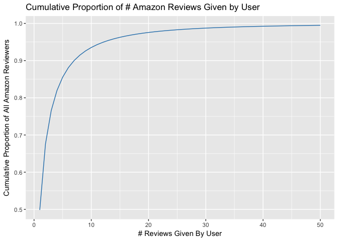
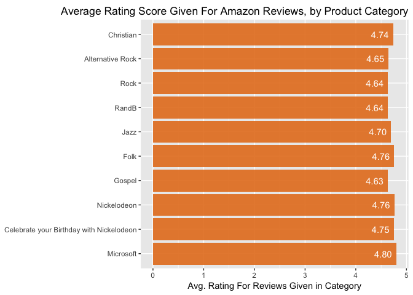

    library(tidyverse)
    library(sparklyr)
    library(stringr)

### Downloading and saving the Review CSV files

    source_directory <- "http://snap.stanford.edu/data/amazon/productGraph/categoryFiles"
    all_files <- readLines("allfiles.txt")
    csv_files <- all_files[!is.na(str_locate(all_files,".csv")[,1])]
    csv_files <- csv_files[csv_files!="ratings_#508510.csv"] 
    csv_files <- csv_files[csv_files!="ratings_.csv"] 

    get_file <- function(filename)
    {
      local_file <- file.path("reviewfiles", filename)
      if(!file.exists(local_file))download.file(url = file.path(source_directory, filename), destfile = local_file)
    }

    get_files <- csv_files %>%
      map(~get_file(.x))

### Merging all files into one large CSV file

    create_allfiles <- function(filename){
      category <- substr(filename, 9, nchar(filename))
      category <- substr(category, 1, nchar(category)-4)
      category <- str_replace_all(category, "_", " ")
      current_file <- read_csv(file.path("reviewfiles", filename), col_names=FALSE)
      current_file$category <- category
      write_csv(current_file, path="allfiles.csv", append=TRUE)
    }
      
    if(!file.exists("allfiles.csv")){
      get_all_files<- csv_files %>%
        map(~create_allfiles(.x))}

### Opening Spark connection

    conf <- spark_config()
    conf$`sparklyr.shell.driver-memory` <- "16G"
    sc <- spark_connect(master="local", config = conf)

### Loading large CSV file into Spark

Cached the file instead of the transformed dataset. Caching the
transformed data frame used to take 10 minutes.

    spark_read_csv(sc, "reviews" ,"allfiles.csv", header = FALSE, memory=TRUE, repartition = 14) 

```{}
    ## Source:   query [8.287e+07 x 5]
    ## Database: spark connection master=local[8] app=sparklyr local=TRUE
    ## 
    ##                V1         V2    V3         V4         V5
    ##             <chr>      <chr> <dbl>      <int>      <chr>
    ## 1  A3ALVBKMDJNWQ9 1030070148     5 1287187200 All Beauty
    ## 2   AUC5DIZXVK5YL B000052YP5     5 1277510400 All Beauty
    ## 3  A118L4M4LQ8KBT B0000530P4     5 1207353600 All Beauty
    ## 4  A2ZM9BGE3K3SY2 B0000533E4     4 1068854400 All Beauty
    ## 5  A1JX8KIY2X0ODQ B0000537SE     1 1399766400 All Beauty
    ## 6  A2PLIED3PX5EYU B00005NAR4     2 1093132800 All Beauty
    ## 7  A2NR683Y06DHPM B00005UKI4     5 1371081600 All Beauty
    ## 8  A2VMFGIDI4OCTV B00005UKI4     5 1354579200 All Beauty
    ## 9  A3MCNTQ29LEE76 B00005UKI4     5 1203292800 All Beauty
    ## 10  A6P2DSY4RR2FW B00005UKI4     5 1275004800 All Beauty
    ## # ... with 8.287e+07 more rows
```

### Initial transformation

    df <- tbl(sc,"reviews") %>%
      select(user_id = V1,
             item_id = V2,
             rating = V3,
             timestamp = V4,
             category = V5)

    df <- df %>% group_by(user_id, item_id) %>% filter(row_number(item_id) == 1) %>% ungroup()

    hours_offset <- 8
    df <- df %>% mutate(timestamp_f = from_unixtime(timestamp + hours_offset*60*60))
    df <- df %>% mutate(hour = hour(timestamp_f),
                        dayofweek = date_format(timestamp_f, 'EEEE'),
                        month = month(timestamp_f),
                        year = year(timestamp_f))

    df <- df %>% group_by(user_id) %>% mutate(user_nth = min_rank(timestamp)) %>% ungroup()
    df <- df %>% group_by(item_id) %>% mutate(item_nth = min_rank(timestamp)) %>% ungroup()

    #sdf_register(df,"data_t")
    #system.time(tbl_cache(sc, "data_t"))
    #df_t <-tbl(sc, "data_t")

    #nrow(df_t <-tbl(sc, "data_t"))

    df_t <- df

### Review summarization

    df_agg <- df_t %>%
      group_by(category) %>%
      summarize(count = n(), avg_rating = mean(rating)) %>%
      arrange(desc(avg_rating)) %>%
      collect()
    df_agg
    
```{}
    ## # A tibble: 81 × 3
    ##                                    category count avg_rating
    ##                                       <chr> <dbl>      <dbl>
    ## 1                                 Microsoft     5   4.800000
    ## 2                               Nickelodeon    21   4.761905
    ## 3                                      Folk  3396   4.758539
    ## 4  Celebrate your Birthday with Nickelodeon     8   4.750000
    ## 5                                 Christian 15223   4.736846
    ## 6                                      Jazz  3867   4.697181
    ## 7                          Alternative Rock  6763   4.648972
    ## 8                                     RandB  4080   4.637255
    ## 9                                      Rock  6203   4.637111
    ## 10                                   Gospel  2026   4.634748
    ## # ... with 71 more rows
```

### Reviews Given by User

    df_user_review_counts <- df_t %>%
                              group_by(user_id) %>%
                              summarize(num_reviews=n()) %>%
                              group_by(num_reviews) %>%
                              summarize(total=n()) %>%
                              arrange(num_reviews) %>%
                              collect()

    df_temp <- df_user_review_counts %>%
                  mutate(norm = total/sum(total), prop = cumsum(norm)) %>%
                  filter(num_reviews <= 50)

    print(ggplot(df_temp, aes(x=num_reviews, y=prop)) +
              geom_line(color="#2980b9") +
              labs(title="Cumulative Proportion of # Amazon Reviews Given by User", x="# Reviews Given By User", y="Cumulative Proportion of All Amazon Reviewers"))



    df_agg <- df_t %>%
                group_by(category) %>%
                summarize(count = n(), avg_rating = mean(rating)) %>%
                arrange(desc(count)) %>%
                collect()
    df_agg

```{}
    ## # A tibble: 81 × 3
    ##                       category    count avg_rating
    ##                          <chr>    <dbl>      <dbl>
    ## 1                        Books 22505744   4.295776
    ## 2                  Electronics  7687720   4.011288
    ## 3   Clothing Shoes and Jewelry  5558186   4.144391
    ## 4                Movies and TV  4519944   4.184618
    ## 5             Home and Kitchen  4252095   4.099521
    ## 6                CDs and Vinyl  3635026   4.404623
    ## 7  Cell Phones and Accessories  3342779   3.804164
    ## 8          Sports and Outdoors  3082923   4.178582
    ## 9     Health and Personal Care  2971849   4.107928
    ## 10            Apps for Android  2602175   3.991202
    ## # ... with 71 more rows
```

    df_temp <- df_agg %>%
      top_n(10)

    ## Selecting by avg_rating

    df_temp$category <- factor(df_temp$category, levels=rev(df_temp$category))
    print(ggplot(df_temp, aes(x=category, y=avg_rating)) +
              geom_bar(stat="identity", fill="#e67e22", alpha=0.9) +
              geom_text(aes(label=sprintf("%0.2f", avg_rating)), color="white", hjust=1.25) +
              coord_flip() +
       theme(plot.title=element_text(vjust=0, hjust=1), axis.title.y=element_blank()) +
              labs(title="Average Rating Score Given For Amazon Reviews, by Product Category", y="Avg. Rating For Reviews Given in Category"))



    spark_disconnect(sc)

Appendix
--------

### List of CSV files loaded into memory

    list.files(path="./reviewfiles")

    ##  [1] "ratings_All_Beauty.csv"                              
    ##  [2] "ratings_All_Credit_Cards.csv"                        
    ##  [3] "ratings_All_Electronics.csv"                         
    ##  [4] "ratings_Alternative_Rock.csv"                        
    ##  [5] "ratings_Amazon_Coins.csv"                            
    ##  [6] "ratings_Amazon_Fashion.csv"                          
    ##  [7] "ratings_Amazon_Fire_TV.csv"                          
    ##  [8] "ratings_Amazon_Instant_Video.csv"                    
    ##  [9] "ratings_Appliances.csv"                              
    ## [10] "ratings_Apps_for_Android.csv"                        
    ## [11] "ratings_Appstore_for_Android.csv"                    
    ## [12] "ratings_Arts_Crafts_and_Sewing.csv"                  
    ## [13] "ratings_Automotive.csv"                              
    ## [14] "ratings_Baby_Products.csv"                           
    ## [15] "ratings_Baby.csv"                                    
    ## [16] "ratings_Beauty.csv"                                  
    ## [17] "ratings_Blues.csv"                                   
    ## [18] "ratings_Books.csv"                                   
    ## [19] "ratings_Broadway_and_Vocalists.csv"                  
    ## [20] "ratings_Buy_a_Kindle.csv"                            
    ## [21] "ratings_Camera_and_Photo.csv"                        
    ## [22] "ratings_Car_Electronics.csv"                         
    ## [23] "ratings_CDs_and_Vinyl.csv"                           
    ## [24] "ratings_Celebrate_your_Birthday_with_Nickelodeon.csv"
    ## [25] "ratings_Cell_Phones_and_Accessories.csv"             
    ## [26] "ratings_Children's_Music.csv"                        
    ## [27] "ratings_Christian.csv"                               
    ## [28] "ratings_Classic_Rock.csv"                            
    ## [29] "ratings_Classical.csv"                               
    ## [30] "ratings_Clothing_Shoes_and_Jewelry.csv"              
    ## [31] "ratings_Collectible_Coins.csv"                       
    ## [32] "ratings_Collectibles_and_Fine_Art.csv"               
    ## [33] "ratings_Computers.csv"                               
    ## [34] "ratings_Country.csv"                                 
    ## [35] "ratings_Dance_and_Electronic.csv"                    
    ## [36] "ratings_Davis.csv"                                   
    ## [37] "ratings_Digital_Music.csv"                           
    ## [38] "ratings_Electronics.csv"                             
    ## [39] "ratings_Entertainment.csv"                           
    ## [40] "ratings_Folk.csv"                                    
    ## [41] "ratings_Gift_Cards_Store.csv"                        
    ## [42] "ratings_Gift_Cards.csv"                              
    ## [43] "ratings_Gospel.csv"                                  
    ## [44] "ratings_GPS_and_Navigation.csv"                      
    ## [45] "ratings_Grocery_and_Gourmet_Food.csv"                
    ## [46] "ratings_Hard_Rock_and_Metal.csv"                     
    ## [47] "ratings_Health_and_Personal_Care.csv"                
    ## [48] "ratings_Home_and_Kitchen.csv"                        
    ## [49] "ratings_Home_Improvement.csv"                        
    ## [50] "ratings_Industrial_and_Scientific.csv"               
    ## [51] "ratings_International.csv"                           
    ## [52] "ratings_Jazz.csv"                                    
    ## [53] "ratings_Kindle_Store.csv"                            
    ## [54] "ratings_Kitchen_and_Dining.csv"                      
    ## [55] "ratings_Latin_Music.csv"                             
    ## [56] "ratings_Learning_and_Education.csv"                  
    ## [57] "ratings_Luxury_Beauty.csv"                           
    ## [58] "ratings_Magazine_Subscriptions.csv"                  
    ## [59] "ratings_Microsoft.csv"                               
    ## [60] "ratings_Miscellaneous.csv"                           
    ## [61] "ratings_Movies_and_TV.csv"                           
    ## [62] "ratings_MP3_Players_and_Accessories.csv"             
    ## [63] "ratings_Musical_Instruments.csv"                     
    ## [64] "ratings_New_Age.csv"                                 
    ## [65] "ratings_Nickelodeon.csv"                             
    ## [66] "ratings_Office_and_School_Supplies.csv"              
    ## [67] "ratings_Office_Products.csv"                         
    ## [68] "ratings_Patio_Lawn_and_Garden.csv"                   
    ## [69] "ratings_Pet_Supplies.csv"                            
    ## [70] "ratings_Pop.csv"                                     
    ## [71] "ratings_Publishers.csv"                              
    ## [72] "ratings_Purchase_Circles.csv"                        
    ## [73] "ratings_RandB.csv"                                   
    ## [74] "ratings_Rap_and_Hip-Hop.csv"                         
    ## [75] "ratings_Rock.csv"                                    
    ## [76] "ratings_Software.csv"                                
    ## [77] "ratings_Sports_and_Outdoors.csv"                     
    ## [78] "ratings_Sports_Collectibles.csv"                     
    ## [79] "ratings_Tools_and_Home_Improvement.csv"              
    ## [80] "ratings_Toys_and_Games.csv"                          
    ## [81] "ratings_Video_Games.csv"                             
    ## [82] "ratings_Wine.csv"
